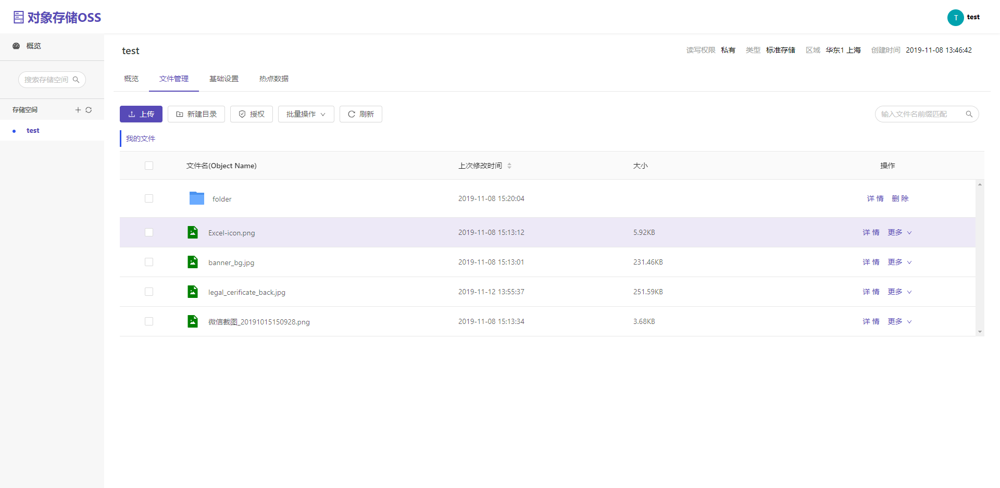

[](https://travis-ci.org/HiCooper/oss-front)

仿写阿里云OSS

example:



在线Demo 示例：https://www.hicooer.cn

## 相关模块

| 项目 | 描述 |
|------|------|
| [oss-java-sdk](https://github.com/HiCooper/oss-sdk-java) | JAVA SKD |
| [oss-backend](https://github.com/HiCooper/oss-backend) | 后端工程，Java 实现|
| [oss-data-service](https://github.com/HiCooper/oss-data-service) | 分布式数据读取存储服务 |


````
username: test
password: 123456
````

## 开发启动

```bash
$ npm install
$ npm start
```

or:

```bash
$ yarn
$ yarn start
```
